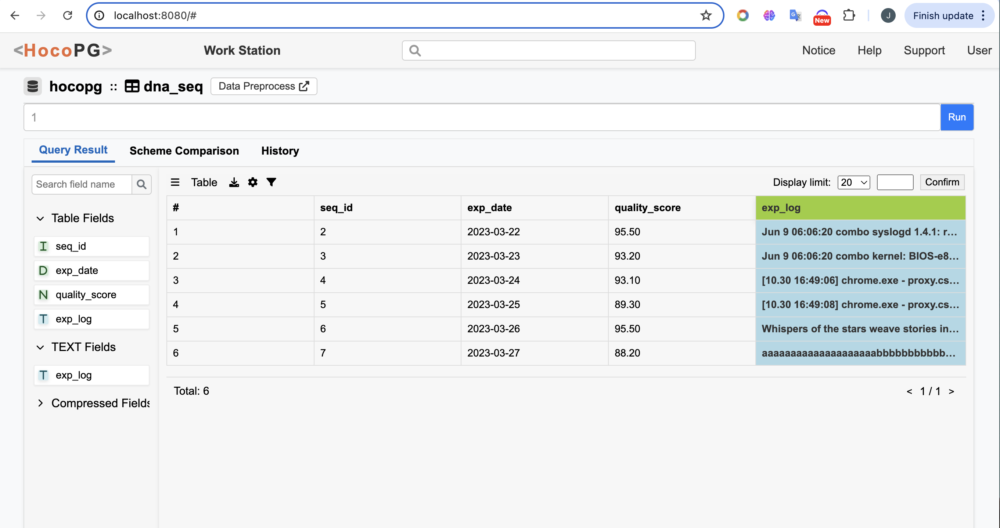

# HocoPG

HocoPG is a database system enhanced with robust compression features that enable direct computations on compressed data without the need for decompression. This system supports a variety of compression algorithms, including the lightweight Run-Length Encoding (RLE) and more intensive TADOC and LZW algorithms. Key functionalities include fast data positioning, partial decompression access, pattern matching, and search queries directly on compressed data. These capabilities are seamlessly integrated within the PostgreSQL query engine and TOAST storage system. HocoPG also utilizes TOAST's compression mechanisms for secondary compression, significantly reducing storage costs and enhancing decompression speeds.

This repository provides the code for the HocoPG Admin interface. For the implementation of the core compression functionality, see [link](https://github.com/yuxin370/postgres).

## Get Started

### Step 1: Install PG
HocoPG is built on PostgreSQL. To get started, install PostgreSQL on either a server or a personal computer. Refer to the official PostgreSQL documentation for installation.

```
git clone -b CompInKernel https://github.com/yuxin370/postgres
```
### Step 2: Install HocoPG-Demo
Create a Django project.
```
pip install django psycopg2-binary psycopg psycopg2
git clone https://github.com/Guan-JW/HocoPG-Demo.git
cd HocoPG-Demo/
```

### Step 3: Set up PG connection
Assuming the PostgreSQL data directory is located at `your/path/to/pg_data`. First, modify the file `your/path/to/pg_data/postgresql.conf` to set the listening address:
```
listen_addresses = '*'
```
Next, edit the file `your/path/to/pg_data/pg_hba.conf` to add the database user connection addresses. Replace `YOUR_FRONTEND_IP` with the IP address of the network where your Django project is located:
```
host    all             all             YOUR_FRONTEND_IP/32        md5
```
Restart the PostgreSQL server:
```
pg_ctl -D your/path/to/pg_data restart
```

### Step 4: Set up local connection
Configure your database connection by modifying file `HocoPG-Demo/hocopg_frontend/settings.py`:
```
DATABASES = {
    'default': {
        'ENGINE': 'django.db.backends.postgresql',
        'NAME': 'YOUR_DB_NAME',   # YOUR DB NAME
        'USER': 'USER_NAME',  # YOUR DB USER NAME
        'PASSWORD': 'YOUR_PASSWORD',  # YOUR DB PASSWORD
        'HOST': 'DB_IP',  # HOST IP
        'PORT': 'DB_PORT', # YOUR DB POST
    }
}
```

### Step 5: Run
Run the HocoPG-Demo project.
```
python3 manage.py migrate
python3 manage.py runserver localhost:8080
```
If the project is successfully running, you will be able to access the interface by visiting localhost:8080 in your web browser.

